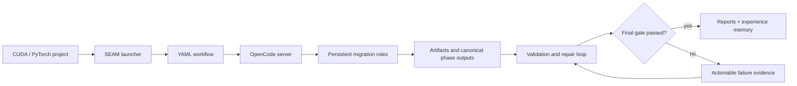
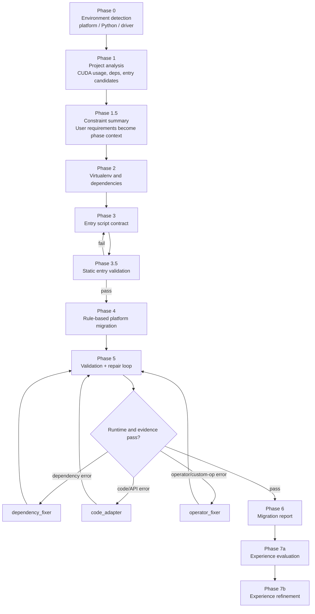
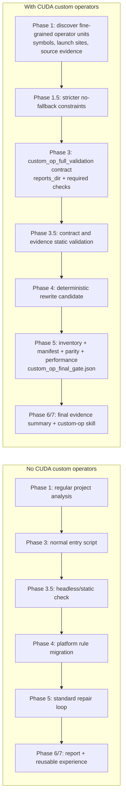

# SEAM: GPU Migration Autopilot

[](src/workflows/)
[](#opencode-server)
[](#quickstart)
[](#cuda-custom-op-vs-normal-flow)

SEAM is a state-machine migration framework for turning CUDA/PyTorch projects into projects that run on alternative accelerator platforms (PPU, Ascend NPU, MUSA, ROCm, MLU). It combines YAML-defined phases, persistent OpenCode agents, deterministic migration rules, validation/repair loops, and experience-memory skills into one auditable migration pipeline.

The core idea is simple: migration is not finished when code has been rewritten. It is finished only when the generated project runs through validation, repair, review, and final evidence gates.

## What SEAM Does

| Capability | What it means |
| --- | --- |
| YAML state machine | Phases, agents, validators, transitions, sub-workflows, and runtime skills are defined in YAML workflow files under `src/workflows/`. |
| OpenCode orchestration | Persistent roles coordinate project analysis, environment setup, code adaptation, dependency repair, and operator repair. |
| Platform policy | `target_platform` presets (PPU, Ascend NPU, MUSA, ROCm, MLU, generic) drive platform-specific validation tokens, migration rules, and evidence requirements. |
| Deterministic migration | Built-in rule migration handles common platform-specific replacements before runtime validation. |
| Validation repair loop | Phase 5 runs the entry command, classifies errors, dispatches specialized repair agents, retries, and fails closed on stalled or invalid evidence. |
| Custom-op final gate | CUDA custom-op projects must produce inventory, manifest, parity, runtime coverage, performance, and no-fallback evidence before passing. |
| Experience memory | Phase 7 evaluates successful or instructive runs and refines them into reusable skills for later migrations. |

## Architecture At A Glance



## Phase Map



## CUDA Custom-Op Vs Normal Flow

SEAM uses one framework for both ordinary CUDA projects and CUDA custom-op projects, but custom-op projects activate a stricter evidence chain. The comparison below is distilled from the custom-op flow design note that contrasts projects with and without CUDA custom operators.



| Phase | Normal CUDA project | CUDA custom-op project |
| --- | --- | --- |
| Phase 0 | Detect platform and runtime basics. | Same as normal. |
| Phase 1 | Analyze project structure, dependencies, CUDA patterns, and entry candidates. | Also discover fine-grained operator units, symbols, launch positions, and source evidence. |
| Phase 1.5 | Summarize migration constraints. | Tighten constraints: full replacement, no CPU fallback, no stub pass. |
| Phase 2 | Prepare virtualenv and dependencies. | Same environment foundation, but later phases use it for operator validation reports. |
| Phase 3 | Produce `entry_script_path` and `run_command`. | Produce a full validation contract: `entry_script_kind`, `reports_dir`, `required_report_paths`, `required_checks`, and entry revision policy. |
| Phase 3.5 | Check that the entry can run headlessly. | Also verify contract coverage and evidence-chain requirements. |
| Phase 4 | Apply deterministic platform migration rules. | Same rewrite phase, but success here is only a candidate state. |
| Phase 5 | Run standard validation and repair loop. | Must close inventory, manifest, parity, runtime coverage, performance, and final-gate evidence. |
| Phase 6 | Produce migration report. | Report final-gate status and operator-level closure evidence. |
| Phase 7 | Extract reusable experience. | Extract specialized custom-op migration skills. |

## Repository Layout

```text
SEAM/
├── src/                    # Core state-machine framework, validators, prompts, workflow YAML, tests
├── .skills/                # Runtime skill packs that can be injected by YAML phases
├── .memory/skills/         # Promoted experience-memory skills
├── .memory/memory/         # Experience cases, staging candidates, and refined lessons
├── docs/                   # Migration notes and project analysis docs
├── scripts/                # Utility checks for local setup
├── tests/                  # Root wrappers for E2E entrypoints
└── e2e-reports/            # Lightweight historical E2E report snapshots
```

The GitHub repository intentionally excludes local project corpora and generated outputs: `.opencode/`, `_migration_manifest/`, `cuda_projects/`, `original_projects/`, and `output_projects/`.

## Quickstart

### 1. Clone and enter the repo

```bash
git clone git@github.com:Fudan-SMI-lab/SEAM.git
cd SEAM
```

### 2. Prepare local project folders

The repository does not ship large project corpora. Put your own CUDA project in one of these local folders:

```bash
mkdir -p cuda_projects output_projects
cp -r /path/to/your_cuda_project cuda_projects/my_project
```

Recommended project shape:

```text
cuda_projects/my_project/
├── ADAPTATION_REQUIREMENTS.md       # optional user constraints
├── original_src/                    # optional clean upstream source
└── test_data_and_scripts/           # optional non-interactive validation entry
    └── run_e2e.py
```

Flat project roots are also accepted; Phase 3 will discover or synthesize an entry command.

## OpenCode Server

SEAM talks to OpenCode through its HTTP server. The recommended port is 4098:

```bash
opencode serve --port 4098 --hostname 127.0.0.1
curl -fsS http://127.0.0.1:4098/agent
```

The Python E2E entrypoint can also auto-start a local server, but for reproducible runs start OpenCode yourself and pass `--server-url http://127.0.0.1:4098`.

## Run A Migration

Two V3 entrypoints are available: the shell launcher (`run_e2e_v3.sh`) and the direct Python module (`e2e_test_v3`). Both support `--workflow-path` to target any platform workflow.

### Smoke E2E (PPU platform)

This uses the container-based PPU smoke workflow. The project directory is discovered from `cuda_projects/` or `original_projects/`:

```bash
bash src/scripts/run_e2e_v3.sh my_project \
  --workflow src/workflows/ppu_migration_v2_container_vllm018_smoke.yaml \
  --server-url http://127.0.0.1:4098 \
  --max-iter 8 \
  --verbose
```

For a project at an arbitrary path, use the direct Python entrypoint instead:

```bash
python3.10 -m tests.e2e.e2e_test_v3 \
  --project-dir /path/to/your_cuda_project \
  --output-dir ./output_projects \
  --workflow-path src/workflows/ppu_migration_v2_container_vllm018_smoke.yaml \
  --server-url http://127.0.0.1:4098 \
  --max-phase5-iter 8 \
  --keep-temp-dir \
  --verbose
```

### DeepWave / Custom-Op E2E (PPU auto-mode)

For projects with CUDA custom operators (e.g. DeepWave), use the auto-mode workflow. Point `--project-dir` at the DeepWave source project root:

```bash
python3.10 -m tests.e2e.e2e_test_v3 \
  --project-dir /path/to/deepwave_project \
  --output-dir ./output_projects \
  --workflow-path src/workflows/ppu_migration_v2_auto_vllm018_smoke_baseaware_entryfix_keep.yaml \
  --server-url http://127.0.0.1:4098 \
  --max-phase5-iter 8 \
  --keep-temp-dir \
  --verbose
```

> The auto-mode workflow uses `execution_backend.mode: auto` with agent-assisted image selection and `cleanup: false` to preserve containers for post-migration inspection. It includes the entryfix Phase 3 prompt with full custom-op contract fields.

### Dry-run setup check

```bash
bash src/scripts/run_e2e_v3.sh my_project \
  --workflow src/workflows/ppu_migration_v2_container_vllm018_smoke.yaml \
  --dry-run \
  --server-url http://127.0.0.1:4098
```

### Default workflow (legacy NPU)

If `--workflow-path` is omitted, the V3 runner falls back to the default NPU workflow (`src/workflows/npu_migration_v2.yaml`):

```bash
bash src/scripts/run_e2e_v3.sh my_project \
  --server-url http://127.0.0.1:4098 \
  --max-iter 8 \
  --verbose
```

## Command Parameters

### `src/scripts/run_e2e_v3.sh`

| Parameter | Meaning |
| --- | --- |
| `<PROJECT_NAME>` | Required. Directory name or path for the CUDA project. Searched under `cuda_projects/`, `original_projects/`, and `application_migration_cases/`. |
| `--workflow PATH` | Path to a workflow YAML file. Overrides the default NPU workflow. Use this to target PPU, MUSA, ROCm, or other platform workflows. |
| `--server-url URL` | OpenCode server URL. Default is `http://127.0.0.1:4098`. |
| `--max-iter N` | Maximum Phase 5 repair iterations (default: 8). |
| `--review` | Enable the Phase 5 review gate (default: enabled). |
| `--no-review` | Disable review gate. |
| `--no-keep-temp` | Do not keep the output project directory after the run (default: keep). |
| `--agent NAME` | Override the auto-detected OpenCode agent name. |
| `--dry-run` | Validate paths and print the command without running the migration. |
| `--verbose` | Enable verbose logging in the Python E2E harness. |
| `--extra 'ARGS...'` | Forward additional arguments to `e2e_test_v3.py`. |

### `python3.10 -m tests.e2e.e2e_test_v3`

| Parameter | Meaning |
| --- | --- |
| `--workflow-path PATH` | Absolute or relative path to a workflow YAML file. Overrides the default NPU workflow. **This is the primary way to select a platform.** |
| `--project-dir PATH` | Source CUDA project path. If omitted, the bundled test template is used. |
| `--output-dir PATH` | Destination root for migrated project copies. Defaults to `output_projects/`. |
| `--server-url URL` | OpenCode server URL. Default is `http://127.0.0.1:4096`; use `http://127.0.0.1:4098` for consistency with the shell launcher. |
| `--max-phase5-iter N` | Maximum repair-loop iterations for Phase 5 (default: 5). |
| `--keep-temp-dir` | Keep the generated/migrated project copy for inspection. |
| `--review-gate` | Enable optional review/improvement loop after runtime success. |
| `--agent NAME` | Override the active agent reported by the OpenCode server. |
| `--user-constraints PATH_OR_TEXT` | User constraints file or literal constraints text injected into Phase 1.5 and later phases. |
| `--framework-config PATH` | Override framework defaults such as iteration counts, review settings, and runtime skill root. |
| `--server-auto-start` | Allow the harness to auto-start OpenCode when using its default URL (default: enabled). |
| `--server-no-auto-start` | Disable auto-start and require an already running OpenCode server. |
| `--server-port PORT` | Preferred local port when auto-starting OpenCode. `0` means choose an available port. |
| `--verbose` | Enable debug logging. |

## Add Skills In YAML

Runtime skills are attached directly to agents, phases, or sub-workflow phases in workflow YAML files under `src/workflows/`.

Minimal list form:

```yaml
phases:
  - id: phase_1_project_analysis
    type: llm
    agent: main_engineer
    prompt_template: phase_1_project_analysis
    runtime_skills:
      - cuda-custom-op-to-npu-custom-op
```

Full mapping form:

```yaml
runtime_skills:
  include:
    - cuda-custom-op-to-npu-custom-op
  inject_full: false
  missing: error
```

| Field | Meaning |
| --- | --- |
| `include` | Skill names to inject or reference. Skills are resolved from configured runtime skill roots such as `.skills/` and promoted skill stores. |
| `inject_full` | `false` injects compact references/paths; `true` injects full skill content into the prompt. Use full injection only when the phase needs the entire checklist. |
| `missing` | Missing skill policy: `error` fails closed, `warn` records a warning, and `ignore` continues silently. |

The built-in custom-op repair path already uses this pattern:

```yaml
- id: fix_operator
  type: llm
  agent: operator_fixer
  prompt_template: repair_operator_fixer
  runtime_skills:
    include:
      - cuda-custom-op-to-npu-custom-op
    inject_full: false
    missing: error
```

To add a new skill:

1. Create `.skills/<skill-name>/SKILL.md` or a structured promoted skill under `skills/`.
2. Reference `<skill-name>` in `runtime_skills.include` at the agent or phase that needs it.
3. Prefer `inject_full: false` for large skills and let agents read the referenced files when needed.
4. Use `missing: error` for mandatory safety or operator-migration skills.

## Safety And Completion Semantics

SEAM deliberately fails closed in places where migration tools often produce false success:

- Phase/session calls with `ok:false` are rejected before canonical success handling.
- OpenCode compaction summaries and unfinished todos do not count as completed work.
- Phase 4 rewrite success is not final success.
- Custom-op projects must pass `migration_reports/custom_op_final_gate.json` machine validation.
- CPU fallback, zero custom-op calls, stubs, missing native build artifacts, missing parity, and incomplete manifest rows block final acceptance.

## Output Artifacts

Each E2E run produces artifacts at several locations:

| Location | Content |
| --- | --- |
| `output_projects/<project>_<timestamp>/` | The migrated project copy with all applied changes. This is your working output. |
| `output_projects/<project>_<timestamp>/.sm-artifacts/` | Per-phase canonical artifacts (journal, telemetry, snapshots). |
| `output_projects/<project>_<timestamp>/migration_reports/` | Key reports written by the entry script: `custom_op_final_gate.json`, `migration_manifest.json`, `performance.json`, `baseline.json`, `runtime_coverage.json`, `build.log`. |
| `e2e-reports/src/<YYYYMMDD_HHMMSS>/` | E2E harness summary and telemetry. |
| `e2e-reports/src/<timestamp>/summary.json` | Top-level run summary: `overall_status`, per-phase status/timing, session/command counts, errors. |
| `e2e-reports/src/<timestamp>/phase_results.json` | Per-phase detailed results. |
| `e2e-reports/src/<timestamp>/before_snapshot.json` / `after_snapshot.json` | Python file snapshots before and after migration for diff analysis. |

### How to analyze results

**Check overall outcome:**
```bash
python3.10 -c "
import json
s = json.load(open('e2e-reports/src/<timestamp>/summary.json'))
print('Status:', s['overall_status'])
for p in s['phases']:
    print(f'  {p[\"phase_id\"]}: {p[\"status\"]} ({p[\"duration_seconds\"]}s)')
"
```

**Check custom-op final gate (for custom-op projects):**
```bash
python3.10 -c "
import json
g = json.load(open('output_projects/<project>_<timestamp>/migration_reports/custom_op_final_gate.json'))
print('Status:', g.get('full_migration_status'))
print('Inventory:', g.get('inventory_count'))
print('Passed/Manifest:', g.get('closed_pass_entries'), '/', g.get('manifest_entries'))
print('Remaining:', g.get('remaining_entries'))
print('Parity:', g.get('report_parity_passed'))
for r in g.get('rows', []):
    nf = r.get('no_fallback_no_zero_call_no_builtin_contamination', {})
    print(f'  {r.get(\"name\",\"?\")}: fallback={nf.get(\"fallback_detected\")} zero_call={nf.get(\"zero_call_detected\")}')
"
```

**Check Phase 5 canonical validation:**
The `.sm-artifacts/` directory contains a run subdirectory (`e2e-v3-<run_id>/`). Look at `output_projects/<project>_<timestamp>/.sm-artifacts/e2e-v3-<run_id>/validated/phase_5_validation_canonical.json` for the validator's final pass/fail report, including `status`, `errors`, and `custom_op_final_gate` status.

**Check performance and baseline:**
`migration_reports/performance.json` contains per-operator timing evidence. `migration_reports/baseline.json` records baseline device measurements. `migration_reports/runtime_coverage.json` shows same-run coverage counts.

**Check build evidence:**
`migration_reports/build.log` must contain platform-native build tokens (e.g. `ppuccl` for PPU, `nvcc` for CUDA, `musacc` for MUSA).

## Platform Policy

### `target_platform` presets

Workflow YAML files declare a platform preset via `target_platform`:

```yaml
target_platform:
  preset: ppu_cuda_compatible
```

Built-in presets: `ppu_cuda_compatible`, `npu_ascend`, `cuda_nvidia`, `musa_muxi`, `rocm_amd`, `mlu_cambrian`, `generic_accelerator`.

Each preset drives platform-specific validation tokens, migration rules, and evidence requirements. Overrides can tune performance validation and baseline device lists:

```yaml
target_platform:
  preset: ppu_cuda_compatible
  overrides:
    custom_op_evidence:
      performance_validation: presence_only
      performance_baseline_device_values:
        - cuda
        - gpu
        - torch_cuda
        - cpu
        - torch_cpu
```

### Custom-op vs normal-entry routes

The framework auto-detects whether a project contains CUDA custom operators and injects the `custom_op_full_validation` contract. To explicitly run a project as **normal-entry** (no custom-op evidence chain), set:

```yaml
globals:
  disable_custom_op_contract_injection: true
```

When this flag is true, the framework does not inject `entry_script_kind: custom_op_full_validation`, and Phase 5's `custom_op_final_gate` builtin returns `{skipped: true, passed: true}`. Do **not** set this flag for projects that actually contain custom operators; the validator detects explicit negative declarations and will fail them.

### Performance validation modes

| Mode | Behavior |
| --- | --- |
| `full` (default) | Requires `baseline_seconds > 0`, `custom_seconds > 0`, and `speedup_vs_baseline > 0`. |
| `presence_only` | Requires timing evidence exists (`baseline_seconds > 0`, `custom_seconds > 0`) but does not enforce speedup superiority. All other gates (no-fallback, source, runtime, native evidence) still apply. Use this for heterogeneous bring-up. |
| `disabled` | Skips performance validation entirely. All other gates still apply. |

### CPU baseline policy

CPU can appear as a baseline device for performance comparison when `performance_baseline_device_values` includes `cpu` / `torch_cpu`. This is a **comparison baseline only**, not a fallback target:

- The custom/migrated route must still prove native device execution and pass the no-fallback evidence gate.
- `no_fallback_no_zero_call_no_builtin_contamination` flags must all be explicitly `false`.
- CPU baseline does not relax any other evidence requirement.

## Useful Checks

```bash
# Validate local improvement contracts
bash src/scripts/verify_improvements.sh --repo-root . --output-dir /tmp/seam-verify

# Show the launcher command without running the migration (V3)
bash src/scripts/run_e2e_v3.sh my_project \
  --workflow src/workflows/ppu_migration_v2_container_vllm018_smoke.yaml \
  --dry-run \
  --server-url http://127.0.0.1:4098

# Run the framework test suite
python -m pytest src/tests -q
```

## License And Citation

This repository packages the SEAM migration framework, workflow definitions, prompts, skills, tests, and documentation for multi-platform GPU migration research and engineering use inside the Fudan-SMI-lab organization.
