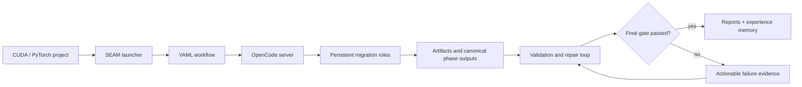
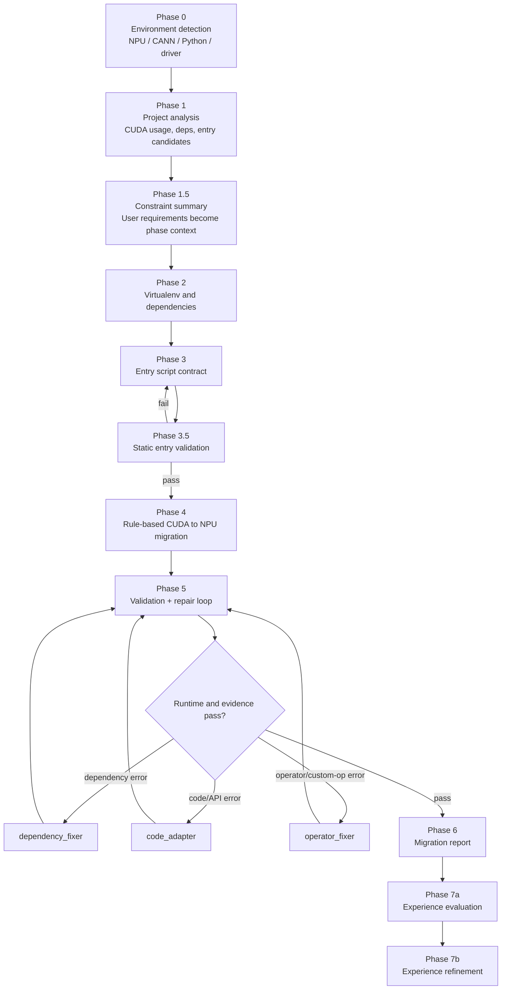
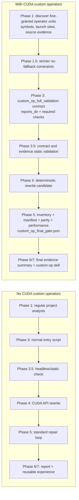

# SEAM: Ascend NPU Migration Autopilot

[](migration_utils/workflows/npu_migration_v2.yaml)
[](#opencode-server)
[](#quickstart)
[](#cuda-custom-op-vs-normal-flow)

SEAM is a state-machine migration framework for turning CUDA/PyTorch projects into Ascend NPU-ready projects. It combines YAML-defined phases, persistent OpenCode agents, deterministic CUDA-to-NPU rewrites, validation/repair loops, and experience-memory skills into one auditable migration pipeline.

The core idea is simple: migration is not finished when code has been rewritten. It is finished only when the generated project runs through validation, repair, review, and final evidence gates.

## What SEAM Does

| Capability | What it means |
| --- | --- |
| YAML state machine | Phases, agents, validators, transitions, sub-workflows, and runtime skills live in `migration_utils/workflows/npu_migration_v2.yaml`. |
| OpenCode orchestration | Persistent roles coordinate project analysis, environment setup, code adaptation, dependency repair, and operator repair. |
| Deterministic migration | Built-in rule migration handles common CUDA-to-NPU replacements before runtime validation. |
| Validation repair loop | Phase 5 runs the entry command, classifies errors, dispatches specialized repair agents, retries, and fails closed on stalled or invalid evidence. |
| Custom-op final gate | CUDA custom-op projects must produce inventory, manifest, parity, runtime coverage, performance, and no-fallback evidence before passing. |
| Experience memory | Phase 7 evaluates successful or instructive runs and refines them into reusable skills for later migrations. |

## Architecture At A Glance



## Phase Map



## CUDA Custom-Op Vs Normal Flow

SEAM uses one framework for both ordinary CUDA projects and CUDA custom-op projects, but custom-op projects activate a stricter evidence chain. This comparison follows the design in `CUSTOM_OP_FLOW_SESSION_CHANGES.md`, section 12.



| Phase | Normal CUDA project | CUDA custom-op project |
| --- | --- | --- |
| Phase 0 | Detect platform and runtime basics. | Same as normal. |
| Phase 1 | Analyze project structure, dependencies, CUDA patterns, and entry candidates. | Also discover fine-grained operator units, symbols, launch positions, and source evidence. |
| Phase 1.5 | Summarize migration constraints. | Tighten constraints: full replacement, no CPU fallback, no stub pass. |
| Phase 2 | Prepare virtualenv and dependencies. | Same environment foundation, but later phases use it for operator validation reports. |
| Phase 3 | Produce `entry_script_path` and `run_command`. | Produce a full validation contract: `entry_script_kind`, `reports_dir`, `required_report_paths`, `required_checks`, and entry revision policy. |
| Phase 3.5 | Check that the entry can run headlessly. | Also verify contract coverage and evidence-chain requirements. |
| Phase 4 | Apply deterministic CUDA-to-NPU migration rules. | Same rewrite phase, but success here is only a candidate state. |
| Phase 5 | Run standard validation and repair loop. | Must close inventory, manifest, parity, runtime coverage, performance, and final-gate evidence. |
| Phase 6 | Produce migration report. | Report final-gate status and operator-level closure evidence. |
| Phase 7 | Extract reusable experience. | Extract specialized custom-op migration skills. |

## Repository Layout

```text
SEAM/
├── migration_utils/        # Core state-machine framework, validators, prompts, workflow YAML, tests
├── .skills/                # Runtime skill packs that can be injected by YAML phases
├── skills/                 # Promoted experience-memory skills
├── memory/                 # Experience cases, staging candidates, and refined lessons
├── docs/                   # Migration notes and project analysis docs
├── scripts/                # Utility checks for local setup
├── tests/                  # Root wrappers for E2E entrypoints
└── e2e-reports/            # Lightweight historical E2E report snapshots
```

The GitHub repository intentionally excludes local project corpora and generated outputs: `.opencode/`, `_migration_manifest/`, `cuda_projects/`, `original_projects/`, and `output_projects/`.

## Quickstart

### 1. Clone and enter the repo

```bash
git clone git@github.com:Fudan-SMI-lab/SEAM.git
cd SEAM
```

### 2. Prepare local project folders

The repository does not ship large project corpora. Put your own CUDA project in one of these local folders:

```bash
mkdir -p cuda_projects output_projects
cp -r /path/to/your_cuda_project cuda_projects/my_project
```

Recommended project shape:

```text
cuda_projects/my_project/
├── ADAPTATION_REQUIREMENTS.md       # optional user constraints
├── original_src/                    # optional clean upstream source
└── test_data_and_scripts/           # optional non-interactive validation entry
    └── run_e2e.py
```

Flat project roots are also accepted; Phase 3 will discover or synthesize an entry command.

## OpenCode Server

SEAM talks to OpenCode through its HTTP server. Start it before using the shell launcher:

```bash
opencode serve --port 4098 --hostname 127.0.0.1
curl -fsS http://127.0.0.1:4098/agent
```

The Python E2E entrypoint can also auto-start a local server when `--server-url` is not explicitly overridden, but for reproducible runs the recommended pattern is to start OpenCode yourself and pass `--server-url`.

## Run A Migration

### Recommended launcher

```bash
bash migration_utils/scripts/run_e2e_v2.sh my_project \
  --server-url http://127.0.0.1:4098 \
  --max-iter 8 \
  --review \
  --verbose
```

The launcher resolves `my_project` from `./cuda_projects/my_project`, `./original_projects/my_project`, or the legacy parent fallbacks. It writes migrated copies into `./output_projects/` and run reports into `./e2e-reports/migration_utils/`.

### Direct Python entrypoint

```bash
python -m tests.e2e.e2e_test_v2 \
  --server-url http://127.0.0.1:4098 \
  --project-dir /absolute/path/to/your_cuda_project \
  --output-dir ./output_projects \
  --max-phase5-iter 8 \
  --keep-temp-dir \
  --review-gate \
  --verbose
```

### Dry-run setup check

```bash
bash migration_utils/scripts/run_e2e_v2.sh my_project \
  --dry-run \
  --server-url http://127.0.0.1:4098
```

## Command Parameters

### `migration_utils/scripts/run_e2e_v2.sh`

| Parameter | Meaning |
| --- | --- |
| `<PROJECT_NAME>` | Required. Directory name or path for the CUDA project. Searched under `cuda_projects/` and `original_projects/`. |
| `--server-url URL` | OpenCode server URL. Launcher default is `http://127.0.0.1:4098`; pass it explicitly for reproducibility. |
| `--max-iter N` | Maximum Phase 5 repair iterations. More iterations allow deeper repair but cost more agent time. |
| `--review` | Enable the Phase 5 review gate. The launcher enables review by default. |
| `--no-review` | Disable review gate and accept Phase 5 success without the optional review pass. |
| `--no-keep-temp` | Do not keep the output project directory after the run. Default behavior keeps it. |
| `--agent NAME` | Override the auto-detected OpenCode agent name. |
| `--dry-run` | Validate paths and print the command without contacting/running the OpenCode migration. |
| `--verbose` | Enable verbose logging in the Python E2E harness. |
| `--extra 'ARGS...'` | Forward additional arguments to `e2e_test_v2.py`. |

### `python -m tests.e2e.e2e_test_v2`

| Parameter | Meaning |
| --- | --- |
| `--server-url URL` | Existing OpenCode server URL. Direct entry default is `http://127.0.0.1:4096`; pass explicitly if using another port. |
| `--max-phase5-iter N` | Maximum repair-loop iterations for Phase 5. |
| `--keep-temp-dir` | Keep the generated/migrated project copy for inspection. |
| `--project-dir PATH` | Source CUDA project path. If omitted, the bundled test template is used. |
| `--agent NAME` | Override the active agent reported by the OpenCode server. |
| `--output-dir PATH` | Destination root for migrated project copies. Defaults to `output_projects/`. |
| `--user-constraints PATH_OR_TEXT` | User constraints file or literal constraints text injected into Phase 1.5 and later phases. |
| `--review-gate` | Enable optional review/improvement loop after runtime success. |
| `--framework-config PATH` | Override framework defaults such as iteration counts, review settings, and runtime skill root. |
| `--server-auto-start` | Allow the harness to auto-start OpenCode when using its default URL. Enabled by default. |
| `--server-no-auto-start` | Disable auto-start and require an already running OpenCode server. |
| `--server-port PORT` | Preferred local port when auto-starting OpenCode. `0` means choose an available port. |
| `--verbose` | Enable debug logging. |

## Add Skills In YAML

Runtime skills are attached directly to agents, phases, or sub-workflow phases in `migration_utils/workflows/npu_migration_v2.yaml`.

Minimal list form:

```yaml
phases:
  - id: phase_1_project_analysis
    type: llm
    agent: main_engineer
    prompt_template: phase_1_project_analysis
    runtime_skills:
      - cuda-custom-op-to-npu-custom-op
```

Full mapping form:

```yaml
runtime_skills:
  include:
    - cuda-custom-op-to-npu-custom-op
  inject_full: false
  missing: error
```

| Field | Meaning |
| --- | --- |
| `include` | Skill names to inject or reference. Skills are resolved from configured runtime skill roots such as `.skills/` and promoted skill stores. |
| `inject_full` | `false` injects compact references/paths; `true` injects full skill content into the prompt. Use full injection only when the phase needs the entire checklist. |
| `missing` | Missing skill policy: `error` fails closed, `warn` records a warning, and `ignore` continues silently. |

The built-in custom-op repair path already uses this pattern:

```yaml
- id: fix_operator
  type: llm
  agent: operator_fixer
  prompt_template: repair_operator_fixer
  runtime_skills:
    include:
      - cuda-custom-op-to-npu-custom-op
    inject_full: false
    missing: error
```

To add a new skill:

1. Create `.skills/<skill-name>/SKILL.md` or a structured promoted skill under `skills/`.
2. Reference `<skill-name>` in `runtime_skills.include` at the agent or phase that needs it.
3. Prefer `inject_full: false` for large skills and let agents read the referenced files when needed.
4. Use `missing: error` for mandatory safety or operator-migration skills.

## Safety And Completion Semantics

SEAM deliberately fails closed in places where migration tools often produce false success:

- Phase/session calls with `ok:false` are rejected before canonical success handling.
- OpenCode compaction summaries and unfinished todos do not count as completed work.
- Phase 4 rewrite success is not final success.
- Custom-op projects must pass `migration_reports/custom_op_final_gate.json` machine validation.
- CPU fallback, zero custom-op calls, stubs, missing `.so` evidence, missing parity, and incomplete manifest rows block final acceptance.

## Useful Checks

```bash
# Validate local improvement contracts
bash migration_utils/scripts/verify_improvements.sh --repo-root . --output-dir /tmp/seam-verify

# Show the launcher command without running the migration
bash migration_utils/scripts/run_e2e_v2.sh my_project --dry-run --server-url http://127.0.0.1:4098

# Run the framework test suite
python -m pytest migration_utils/tests -q
```

## License And Citation

This repository packages the SEAM migration framework, workflow definitions, prompts, skills, tests, and documentation for Ascend NPU migration research and engineering use inside the Fudan-SMI-lab organization.
